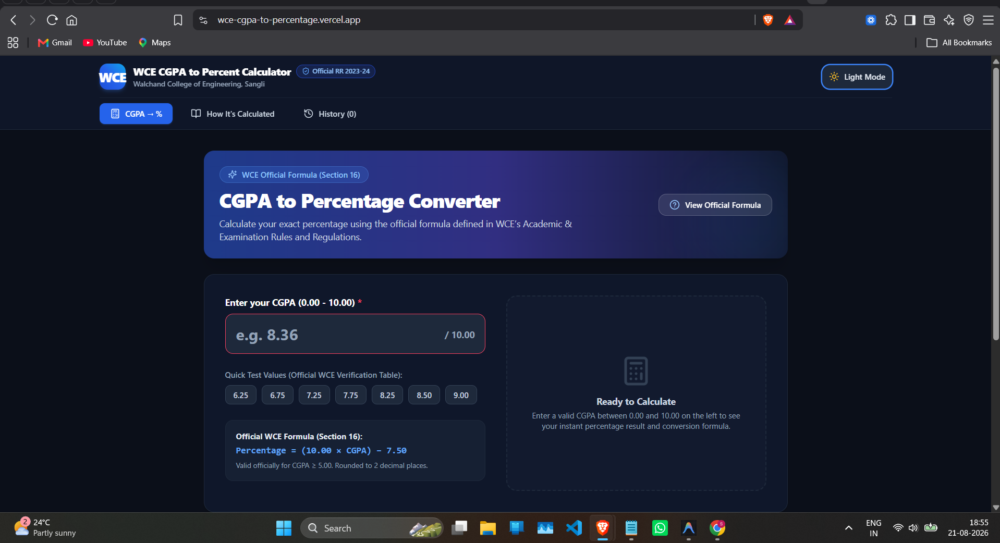

# 🎓 WCE CGPA to Percentage Converter

> **Official Grade Conversion & Academic Utility for Walchand College of Engineering, Sangli (Maharashtra, India) Students.**

[](https://wce-cgpa-to-percentage.vercel.app/)
[](https://astro.build/)
[](https://www.typescriptlang.org/)
[](https://tailwindcss.com/)

---

## 📌 Table of Contents

- [🌐 Live Site](#-live-site)
- [✨ Key Features](#-key-features)
- [📸 Demo Preview](#-demo-preview)
- [🛠️ Tech Stack](#️-tech-stack)
- [🔒 Security & Privacy](#-security--privacy)
- [🚀 Getting Started](#-getting-started)
- [🧪 Testing](#-testing)
- [📁 Project Structure](#-project-structure)
- [⚖️ Legal Disclaimer](#️-legal-disclaimer)

---

## 🌐 Live Site

🔗 **[WCE CGPA to Percentage Converter](https://wce-cgpa-to-percentage.vercel.app/)**

This is the deployed, publicly accessible version of the application hosted on Vercel.

It is an independent, unofficial Grade Conversion & Academic Utility built strictly according to the authoritative formulas and grade point scales defined in WCE's **"Academic and Examination Rules and Regulations 2023-24"** (Sections 12 and 16).

---

## ✨ Key Features

- **⚡ Core CGPA to Percentage Converter (Route `/`)**:
  - Official WCE conversion formula: $\text{Percentage} = (10.00 \times \text{CGPA}) - 7.50$
  - Live input validation ($0.00$ to $10.00$) with real-time error guidance.
  - Substituted formula breakdown showing step-by-step math with actual user inputs.
  - Automatic official warning note for CGPA $< 5.00$ as per WCE policy.
  - **Quick Test Value** preset buttons ($6.25$, $6.75$, $7.25$, $7.75$, $8.25$, $8.50$, $9.00$, $10.00$) matching WCE's official verification table.
- **📄 Client-Side PDF & PNG Report Card Export**:
  - Download high-resolution PNG or print-ready PDF grade conversion reports using `html2canvas` and `jsPDF`.
- **📖 Educational "How It's Calculated" Section (Route `/how-its-calculated`)**:
  - Complete reference guide with the official WCE Grade Point Table (AA=10, AB=9, BB=8, etc.), Section 12/16 rules, and worked examples.
- **💾 Local History Panel (Route `/history`)**:
  - Safe browser `localStorage` integration storing past CGPA conversions with timestamping and 1-click clear action.
- **🌙 Dark & Light Theme Modes**:
  - Binance-themed dark design with light mode toggle and persistent user preference.
- **📋 Legal & Info Pages**:
  - Dedicated pages for [Privacy Policy (`/privacy-policy`)](https://wce-cgpa-to-percentage.vercel.app/privacy-policy), [Terms of Use (`/terms`)](https://wce-cgpa-to-percentage.vercel.app/terms), [About Us (`/about`)](https://wce-cgpa-to-percentage.vercel.app/about), and [Contact Us (`/contact`)](https://wce-cgpa-to-percentage.vercel.app/contact).

---

## 📸 Demo Preview



---

## 🛠️ Tech Stack

| Technology | Purpose |
| :--- | :--- |
| **[Astro](https://astro.build/)** | High-performance multi-page static site generator |
| **[TypeScript](https://www.typescriptlang.org/)** | Type-safe strict calculation models & contracts |
| **[Tailwind CSS v4](https://tailwindcss.com/)** | Design system implementation with Binance tokens (`DESIGN.md`) |
| **[Vitest 3](https://vitest.dev/)** | Unit testing framework for math engine correctness |
| **Canvas API & [jsPDF](https://github.com/parallax/jsPDF)** | Client-side PNG/PDF report export |

---

## 🔒 Security & Privacy

- **100% Client-Side**: No backend server, no database, no external data tracking. All calculations happen entirely within the user's browser.
- **Strict Input Validation**: Client-side boundary checks ($0.00$ to $10.00$).
- **Zero Secrets**: No API keys, credentials, or backend endpoints required.
- **HTTPS Enforcement**: Deployed on Vercel with automatic TLS encryption.

---

## 🚀 Getting Started

### Prerequisites
- **Node.js**: `v18.0.0` or higher
- **npm**: `v9.0.0` or higher

### Installation & Local Setup

```bash
git clone https://github.com/shreyashk07004/wce_calci.git
cd wce_calci
npm install
npm run dev
```

---

## 🧪 Testing

Run the authoritative unit test suite validating calculations against WCE Academic Regulations 2023-24:

```bash
npm test
```

---

## 📁 Project Structure

```
.
├── astro.config.mjs
├── package.json
├── tsconfig.json
├── vercel.json
├── DESIGN.md
├── public/
│   ├── favicon.svg
│   ├── robots.txt
│   ├── sitemap.xml
│   └── screenshot.png
└── src/
    ├── components/
    │   ├── Calculator.astro
    │   ├── ConversionTable.astro
    │   ├── FaqSection.astro
    │   ├── Footer.astro
    │   ├── HistoryPanel.astro
    │   └── Navbar.astro
    ├── layouts/
    │   └── Layout.astro
    ├── pages/
    │   ├── about.astro
    │   ├── contact.astro
    │   ├── history.astro
    │   ├── how-its-calculated.astro
    │   ├── index.astro
    │   ├── privacy-policy.astro
    │   └── terms.astro
    ├── styles/
    │   └── global.css
    ├── types/
    │   └── grade.ts
    └── utils/
        ├── gradeCalculations.test.ts
        ├── gradeCalculations.ts
        ├── pdfExport.ts
        ├── routeMetadata.test.ts
        ├── routeMetadata.ts
        └── storage.ts
```

---

## ⚖️ Legal Disclaimer

This is an independent, unofficial tool built by a student for the convenience of WCE Sangli students. It is not affiliated with, endorsed by, or an official product of Walchand College of Engineering. Calculations are based on the published WCE Academic and Examination Rules and Regulations 2023-24. Always verify your official CGPA and percentage with the WCE Examination Section or your official grade card.
