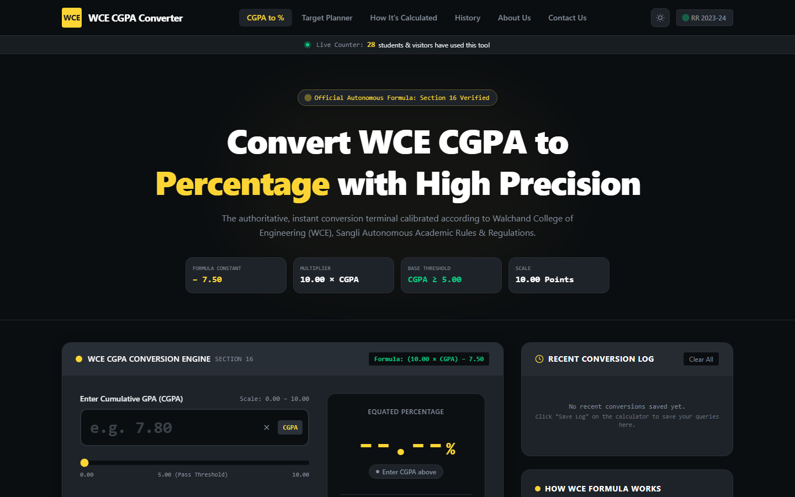
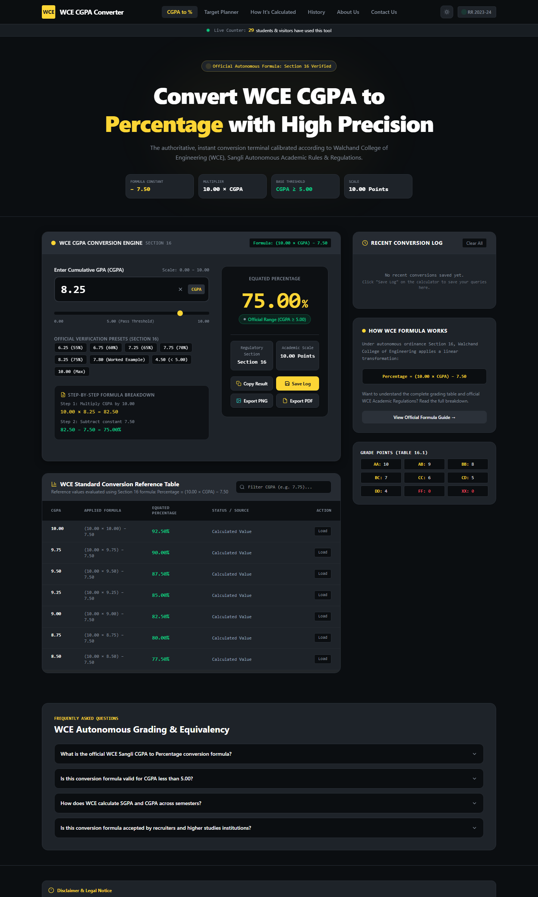
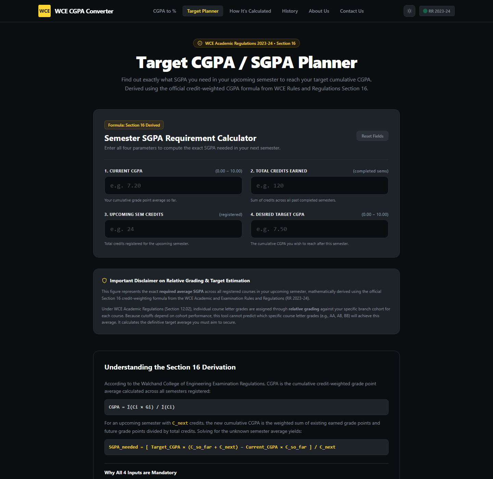
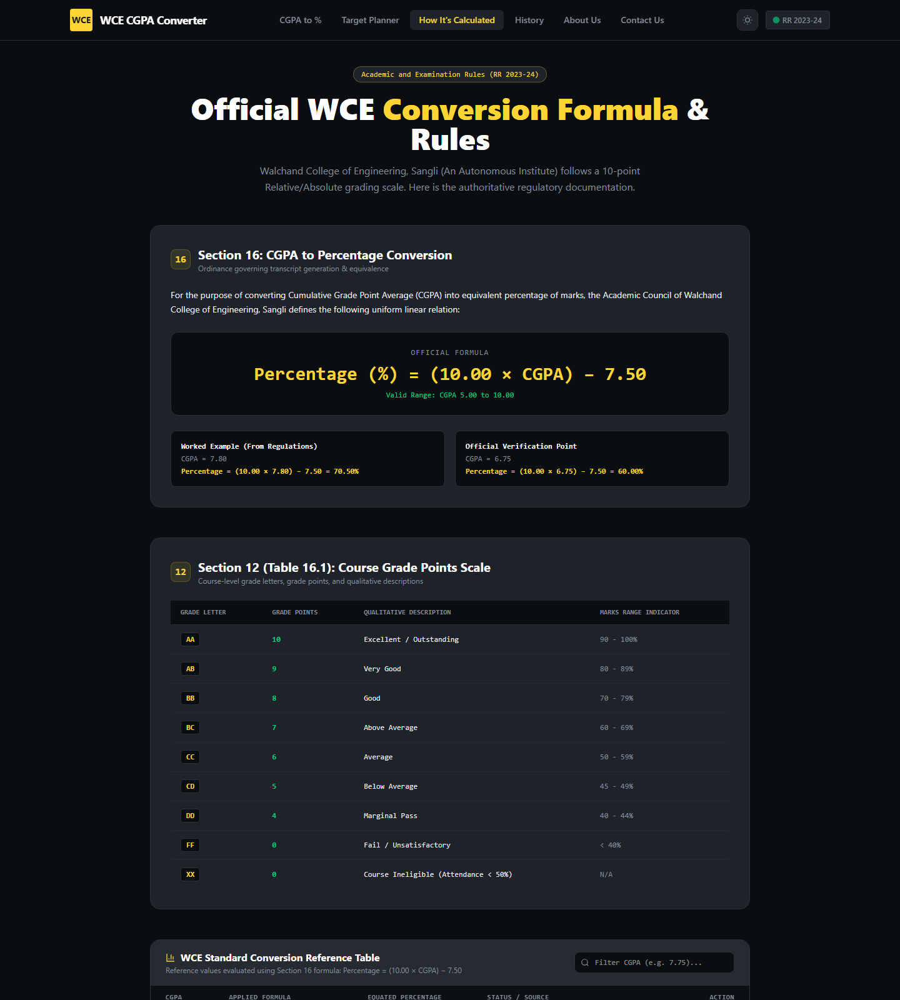
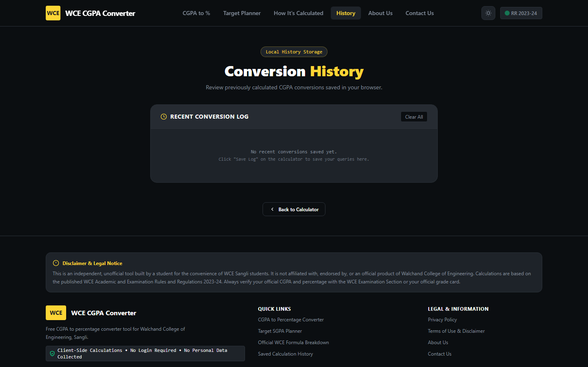

<div align="center">

# 🎓 WCE CGPA to Percentage Converter

**A fast, accurate grade-conversion and academic-planning tool for students of Walchand College of Engineering (WCE), Sangli.**

Built on the official formulas in WCE's *Academic and Examination Rules and Regulations 2023-24* (Sections 12 and 16).

[](https://wce-cgpa-to-percentage.vercel.app/)

[](https://astro.build/)
[](https://www.typescriptlang.org/)
[](https://tailwindcss.com/)
[](https://vitest.dev/)
[](https://vercel.com/)

<br />



</div>

---

## 📑 Table of Contents

1. [Overview](#-overview)
2. [Live Website](#-live-website)
3. [Screenshots](#-screenshots)
4. [Features](#-features)
5. [User Guide](#-user-guide)
6. [The Official Formulas](#-the-official-formulas)
7. [Site Map](#-site-map)
8. [Tech Stack](#️-tech-stack)
9. [Architecture](#-architecture)
10. [Project Structure](#-project-structure)
11. [Quality & Testing](#-quality--testing)
12. [Privacy & Security](#-privacy--security)
13. [SEO & Performance](#-seo--performance)
14. [Ownership & Usage Rights](#-ownership--usage-rights)
15. [Disclaimer](#️-disclaimer)
16. [Contact](#-contact)

---

## 🔍 Overview

WCE grade cards report performance as a **CGPA on a 10-point scale**, but employers, higher-studies applications and government forms often ask for a **percentage**. WCE's regulations define an official conversion, but students are often unsure which formula applies, and they make arithmetic slips.

This website fixes that. It gives you:

- **An instant CGPA → percentage converter** that uses the exact WCE formula and shows each calculation step.
- **A target planner** that tells you the SGPA you need next semester to reach a goal CGPA.
- **A plain-language guide** to the WCE grading scale and conversion rules.
- **Downloadable reports** (PNG / PDF) of your converted result.

All grade calculations run **entirely in your browser**. You don't need to sign up or log in, and your academic data is never collected.

---

## 🌐 Live Website

> 🔗 **https://wce-cgpa-to-percentage.vercel.app/**

The site is deployed and maintained by the owner on Vercel. You can use it in any modern desktop or mobile browser without installing anything.

---

## 📸 Screenshots

### CGPA to Percentage Converter
Enter a CGPA and the result, formula breakdown and range status update instantly.



### Target CGPA / SGPA Planner
Find out exactly what SGPA you need next semester to reach your target CGPA.



### How It's Calculated
The official Section 16 formula, worked examples and the complete Table 16.1 grade-point scale.



### Conversion History
Saved conversions stay in your own browser and can be cleared with one click.



---

## ✨ Features

### ⚡ CGPA → Percentage Converter (`/`)
| Capability | Details |
| :--- | :--- |
| Official formula | `Percentage = (10.00 × CGPA) − 7.50`, per Section 16 |
| Dual input | Type a value **or** drag the slider (0.00 – 10.00) |
| Live validation | Out-of-range or invalid input shows an inline error |
| Step-by-step breakdown | Shows the formula with your own value substituted, step by step |
| Range status badge | Marks whether the result is in the official range (CGPA ≥ 5.00) |
| Below-threshold notice | Shows an official note when CGPA < 5.00 |
| Verification presets | One-click values from WCE's verification table: 6.25, 6.75, 7.25, 7.75, 8.25, 7.80 (worked example), 4.50, 10.00 |
| Result actions | **Copy Result**, **Save Log**, **Export PNG**, **Export PDF** |

### 📊 Standard Conversion Reference Table
- Precomputed conversions from CGPA **5.00 to 10.00**.
- Highlights official verification-table values and the worked example from the regulations.
- **Live filter** box to find a CGPA quickly.
- **Load** button that sends any row straight to the calculator, and works from other pages too.

### 🎯 Target SGPA Planner (`/sgpa-target-planner`)
Takes four inputs: **current CGPA**, **credits earned so far**, **credits in the upcoming semester**, and **target CGPA**. It then reports one of these outcomes:

| Outcome | Meaning |
| :--- | :--- |
| ✅ **Achievable** | You need an average SGPA between 4.00 and 10.00, and the tool shows the exact figure. |
| 🟢 **Easily secured** | The SGPA you need is ≤ 4.00 (the DD pass grade), so passing every course already meets the target. |
| 🏁 **Already met** | Your current CGPA already meets or beats the target. |
| ⛔ **Not achievable this semester** | You would need an SGPA above 10.00. The tool shows the **maximum CGPA** you can still reach. |

It also shows how it works: total grade points needed, grade points already earned, and the difference.

### 📖 Formula & Rules Guide (`/how-its-calculated`)
- Explains Section 16, including the worked example (CGPA 7.80 → 70.50%).
- Lists the full **Section 12 / Table 16.1** grade-point scale (AA = 10 through FF / XX = 0).
- Includes the searchable reference table.

### 💾 Local History (`/history`)
- Stores up to **50** saved conversions with timestamps.
- Keeps everything in the browser's `localStorage`, and never sends it to a server.
- **Clear All** removes the history instantly.
- Falls back safely in private or restricted browser modes.

### 🎨 Interface
- **Dark and light themes.** The site follows your system preference at first, and remembers your choice after you toggle it.
- **Responsive layout** for phones, tablets and desktops.
- **Live visitor counter** that shows how many students have used the tool.
- **FAQ accordion** answering common WCE grading questions.
- Dedicated **About**, **Contact**, **Privacy Policy** and **Terms of Use** pages.

---

## 🧭 User Guide

### Convert your CGPA to a percentage
1. Open the [**home page**](https://wce-cgpa-to-percentage.vercel.app/).
2. Type your CGPA into **"Enter Cumulative GPA (CGPA)"**, or drag the slider.
3. The **Equated Percentage** appears immediately, and the **Step-by-Step Formula Breakdown** shows the math.
4. If you like, use the actions under the result:
   - **Copy Result**: copies the result to your clipboard.
   - **Save Log**: saves the conversion to your local history.
   - **Export PNG / Export PDF**: downloads a report card of the result.

> 💡 **Tip:** Click any **Load** button in the reference table to fill the calculator with that value.
> You can also link straight to a result, for example [`/?cgpa=8.25`](https://wce-cgpa-to-percentage.vercel.app/?cgpa=8.25).

### Plan the SGPA you need
1. Open [**Target Planner**](https://wce-cgpa-to-percentage.vercel.app/sgpa-target-planner).
2. Fill in all four fields: current CGPA, credits earned so far, upcoming semester credits, and target CGPA.
3. Read the outcome and the grade-point breakdown.
4. Click **Reset Fields** to start over.

> ⚠️ WCE uses **relative grading**, so letter-grade cut-offs depend on how your cohort performs. The planner tells you the **average SGPA** to aim for, not which letter grades you'll get in each course.

### Review saved conversions
Open [**History**](https://wce-cgpa-to-percentage.vercel.app/history) to see your saved conversions, or click **Clear All** to delete them.

---

## 🧮 The Official Formulas

### CGPA → Percentage (Section 16)

$$\text{Percentage} = (10.00 \times \text{CGPA}) - 7.50$$

| CGPA | Calculation | Percentage | Source |
| :---: | :--- | :---: | :--- |
| 10.00 | (10.00 × 10.00) − 7.50 | **92.50%** | Maximum |
| 8.25 | (10.00 × 8.25) − 7.50 | **75.00%** | WCE verification table |
| 7.80 | (10.00 × 7.80) − 7.50 | **70.50%** | Worked example in regulations |
| 7.75 | (10.00 × 7.75) − 7.50 | **70.00%** | WCE verification table |
| 6.75 | (10.00 × 6.75) − 7.50 | **60.00%** | WCE verification table |
| 5.00 | (10.00 × 5.00) − 7.50 | **42.50%** | Official lower threshold |

> The regulations define this formula for **CGPA ≥ 5.00**. The site still shows values below 5.00, but marks them as mathematical references only.

### Grade Points (Section 12, Table 16.1)

| Grade | AA | AB | BB | BC | CC | CD | DD | FF | XX |
| :--- | :-: | :-: | :-: | :-: | :-: | :-: | :-: | :-: | :-: |
| **Points** | 10 | 9 | 8 | 7 | 6 | 5 | 4 | 0 | 0 |
| **Meaning** | Excellent | Very Good | Good | Above Avg. | Average | Below Avg. | Marginal Pass | Fail | Ineligible (attendance < 50%) |

### Target SGPA (derived from Section 16)
CGPA is a credit-weighted average, $\text{CGPA} = \dfrac{\sum C_i G_i}{\sum C_i}$. Solving it for next semester's SGPA gives:

$$\text{SGPA}_{\text{needed}} = \frac{\text{Target} \times (C_{\text{so far}} + C_{\text{next}}) - \text{Current} \times C_{\text{so far}}}{C_{\text{next}}}$$

---

## 🗺 Site Map

| Route | Page | Purpose |
| :--- | :--- | :--- |
| [`/`](https://wce-cgpa-to-percentage.vercel.app/) | CGPA to % | Main converter, reference table, FAQ |
| [`/sgpa-target-planner`](https://wce-cgpa-to-percentage.vercel.app/sgpa-target-planner) | Target Planner | Finds the SGPA needed to reach a target CGPA |
| [`/how-its-calculated`](https://wce-cgpa-to-percentage.vercel.app/how-its-calculated) | How It's Calculated | Official formula and grade-point guide |
| [`/history`](https://wce-cgpa-to-percentage.vercel.app/history) | History | Locally saved conversions |
| [`/about`](https://wce-cgpa-to-percentage.vercel.app/about) | About Us | Project background |
| [`/contact`](https://wce-cgpa-to-percentage.vercel.app/contact) | Contact Us | Contact details and feedback |
| [`/privacy-policy`](https://wce-cgpa-to-percentage.vercel.app/privacy-policy) | Privacy Policy | Data-handling policy |
| [`/terms`](https://wce-cgpa-to-percentage.vercel.app/terms) | Terms of Use | Terms and disclaimer |

---

## 🛠️ Tech Stack

| Layer | Technology | Role |
| :--- | :--- | :--- |
| Framework | **[Astro](https://astro.build/)** | Static multi-page site generation that ships little JavaScript |
| Language | **[TypeScript](https://www.typescriptlang.org/)** | Type-safe calculation engine and data models |
| Styling | **[Tailwind CSS v4](https://tailwindcss.com/)** | Utility-first styling with a custom dark/light design system (see `DESIGN.md`) |
| Export | **Canvas API** + **[jsPDF](https://github.com/parallax/jsPDF)** | Builds PNG and PDF reports in the browser |
| Storage | **Web `localStorage`** | Private, on-device conversion history and theme preference |
| Serverless | **Vercel Functions** + **Upstash Redis** | Anonymous visitor counter (`/api/visitor-count`) |
| Testing | **[Vitest](https://vitest.dev/)** | Unit tests for formulas and route metadata |
| Hosting | **[Vercel](https://vercel.com/)** | Global CDN, automatic HTTPS |

---

## 🧱 Architecture

```
                 ┌───────────────────────────── Browser ─────────────────────────────┐
                 │                                                                    │
 Static HTML ───▶│  Astro pages ──▶ Components ──▶ utils/gradeCalculations.ts         │
 (Vercel CDN)    │                                  utils/targetPlanner.ts            │
                 │                                  utils/pdfExport.ts  ──▶ PNG / PDF │
                 │                                  utils/storage.ts    ──▶ localStorage
                 │                                                                    │
                 └──────────────────────────────┬─────────────────────────────────────┘
                                                │ anonymous count only (no personal data)
                                                ▼
                                   /api/visitor-count  ──▶  Upstash Redis
```

- **The calculation engine is plain functions.** The formulas live in `src/utils` as pure TypeScript functions with no side effects, and unit tests check them against the regulation values.
- **Pages are pre-rendered.** Astro builds every page as static HTML, and only the interactive widgets load JavaScript.
- **The single serverless function holds no data about users.** The visitor counter only increments or reads one integer. If Redis is unavailable, the counter badge is hidden and the rest of the site keeps working.

---

## 📁 Project Structure

```
.
├── api/
│   └── visitor-count.js         # Vercel serverless function – anonymous visitor counter
├── docs/
│   └── screenshots/             # Images used in this README
├── public/
│   ├── favicon.svg
│   ├── robots.txt
│   └── sitemap.xml
├── src/
│   ├── components/
│   │   ├── Calculator.astro       # Main CGPA → % converter + export actions
│   │   ├── ConversionTable.astro  # Searchable reference table
│   │   ├── FaqSection.astro       # FAQ accordion
│   │   ├── Footer.astro           # Footer + legal disclaimer
│   │   ├── HistoryPanel.astro     # Saved-conversion log
│   │   ├── Navbar.astro           # Navigation + theme toggle
│   │   ├── TargetPlanner.astro    # Target SGPA planner UI
│   │   └── VisitorCounter.astro   # Live visitor badge
│   ├── layouts/
│   │   └── Layout.astro           # Shared shell, SEO meta, theme bootstrap
│   ├── pages/                     # One file per route (see Site Map)
│   ├── styles/
│   │   └── global.css             # Tailwind + design tokens
│   ├── types/
│   │   └── grade.ts               # Grade & result type definitions
│   └── utils/
│       ├── gradeCalculations.ts   # Section 12/16 formula engine
│       ├── targetPlanner.ts       # Target SGPA solver
│       ├── pdfExport.ts           # PNG / PDF report generation
│       ├── storage.ts             # Safe localStorage wrapper
│       ├── routeMetadata.ts       # Per-page SEO metadata
│       └── *.test.ts              # Vitest unit tests
├── astro.config.mjs
├── vercel.json
└── DESIGN.md                      # Design-system reference
```

---

## ✅ Quality & Testing

- **Unit tests** check the conversion engine against the official WCE verification table and the worked example (CGPA 7.80 → 70.50%). They also cover the below-5.00 warning, out-of-range input and rounding.
- **Route metadata tests** make sure every page has its own title and description, and that unknown routes fall back to the homepage metadata.
- **Rounding** is exact to two decimal places (with `Number.EPSILON` compensation) to avoid floating-point errors such as `70.49999…`.
- **Input validation** is enforced in both the UI and the calculation layer.

---

## 🔒 Privacy & Security

| Principle | How it's applied |
| :--- | :--- |
| **No personal data** | No accounts, logins, forms or cookies collect personal information. |
| **Client-side math** | Every grade calculation runs in your browser, and your CGPA is never sent to a server. |
| **Local-only history** | Saved conversions stay in your browser's `localStorage`, and you can clear them at any time. |
| **Anonymous counter** | The visitor counter stores a single total and nothing that identifies a visitor. |
| **Secrets kept server-side** | Redis credentials live only in Vercel environment variables, never in client code. |
| **HTTPS everywhere** | Vercel serves every page over TLS. |

Read the full [Privacy Policy](https://wce-cgpa-to-percentage.vercel.app/privacy-policy).

---

## 🚀 SEO & Performance

- Static pre-rendered pages load fast and need very little JavaScript.
- Every route has its own title and meta description.
- `sitemap.xml` and `robots.txt` are provided for search engines, and the site is verified with Google Search Console.
- Semantic HTML and keyboard-accessible controls.

---

## 🔐 Ownership & Usage Rights

This project, including its source code, design and content, is **privately owned and maintained by [@shreyashk07004](https://github.com/shreyashk07004)**.

- The **live website is free for anyone to use**.
- **Only the owner may modify, redeploy or publish** this codebase. Pull requests and forks meant for redistribution are not accepted.
- Copying, rehosting or rebranding this project without written permission is not allowed.

© 2026 shreyashk07004. **All rights reserved.**

---

## ⚖️ Disclaimer

This is an **independent, unofficial** tool built by a student for WCE Sangli students. It is **not affiliated with, endorsed by, or an official product of Walchand College of Engineering**. Calculations follow the published *WCE Academic and Examination Rules and Regulations 2023-24*. Always confirm your official CGPA and percentage with the **WCE Examination Section** or your official grade card.

---

## 📬 Contact

Have feedback, found a bug, or noticed a regulation change? Get in touch through the [**Contact page**](https://wce-cgpa-to-percentage.vercel.app/contact).

<div align="center">
<br />

Made with ❤️ for the students of **Walchand College of Engineering, Sangli**.

</div>
